# DIC_Terrace-Farming-Robot

### Introduction

The trend of maximizing agricultural resources, in a sustainable manner, is positively
influencing farmers with its growing demand in the world’s food supply chain. IoT has
become a mainstream technology, driving several industries such as transportation,
manufacturing, agriculture, and others. The increasing use of precision agriculture, among
farmers, for collecting and processing data helps in making better decisions on fertilizing,
planting, and harvesting crops. 

The proliferation of IoT has revolutionized the agriculture industry that primarily depends
on technology, engineering, and physical and biological sciences. Furthermore, the
increasing labor wages and untrained labor have also propelled farmers to use a costefficient method for increasing productivity, which is likely to influence the industry growth
over the projected period. 

### AGRICULTURAL BOTS MARKET SEGMENT ANALYSIS

The driverless tractor product segment is expected to have significant growth. Autonomous
tractors have the ability of planting, seeding, and tillage for row and broad acre crop
farming. The growing industrialization of the agriculture sector, across regions, including
India, China are likely to influence the segment growth. 

Based on application, the industry is segmented into field farming, dairy management,
animal management, soil management, and crop management. The dairy management
segment dominated the market in terms of revenue in 2015 and was valued at 585.6
Million. The soil management segment is anticipated to witness highest growth rate over
the projected period. The growth is driven by growing deployment of mobile field robot, for
weeding and fertilizing, is expected to drive the segment demand over the forecast period.
Asia Pacific region is the fastest growing region, owing to the faster rate of adoption of
autonomous technologies in the agriculture industry.

Some of the key points which are driving the market for agricultural bots in
Asia-pacific region are:
1. Increasing adoption of automation technologies in terrace farming.
2. Declining availability of farm workers.
3. Growing demand for food and agricultural supply.
4. Increasing government support to adopt to new agricultural technologies. 

### EXISTING TECHNOLOGIES

Swarm Robotics : Swarm robotics is an advent in the coordination and multitasking of
multi-robot systems which consist of large numbers of mostly simple physical robots.
This robot uses MSP430 family of ultra-low-power microcontrollers with built-in 16-bit
timers, up to 24 I/O pins, a versatile analog comparator, and built-in communication
capability using the universal serial communication interface.For the wireless
communication of data, ZigBee is used. ZigBee is a low-cost, low-power, wireless mesh
network standard. The motors for the movement of the robot is implemented using
L293DNE quadruple high current H-Driver used to control 2 bidirectional motors.
Example of Swarm robots being used in 

**Drones** : There are also drones currently available and in development for crop spraying
applications, offering the chance to automate yet another labor-intensive task. Using a
combination of GPS, laser measurement and ultrasonic positioning, crop-spraying
drones can adapt to altitude and location easily, adjusting for variables such as wind
speed, topography and geography. This enables the drones to perform crop spraying
tasks more efficiently, and with greater accuracy and less waste. 

A drone called Agras MG-1 designed specifically for agricultural crop spraying, with a
tank capacity of 2.6 gallons (10 liters) of liquid pesticide, herbicide or fertilizer, and a flight
range of seven to ten acres per hour. Microwave radar enables this drone to maintain
correct distance from the crops and ensure even coverage. 

### HARDWARE MECHANISM

#### LOCOMOTION

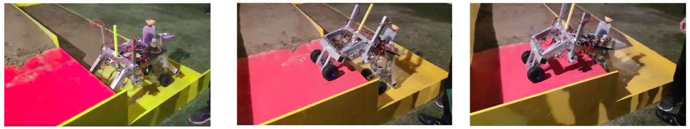

### UTILITIES

#### PLOUGHING: 

The first and foremost step in the farming is
ploughing. This process is done in order to
loosen the soil and create a path or tracks on
the farm land in order to sow the seeds
uniformly . The structure and the design of the
plough tool depends on the various constraints
such as the type of soil to be ploughed and the
depth required based on the type of crop that
has to be grown and so on. We have designed
a light weight Aluminium head for ploughing
which is connected to a servo motor.. The
design and dimensions of the plough tool are in
accordance with the size of the bot. 

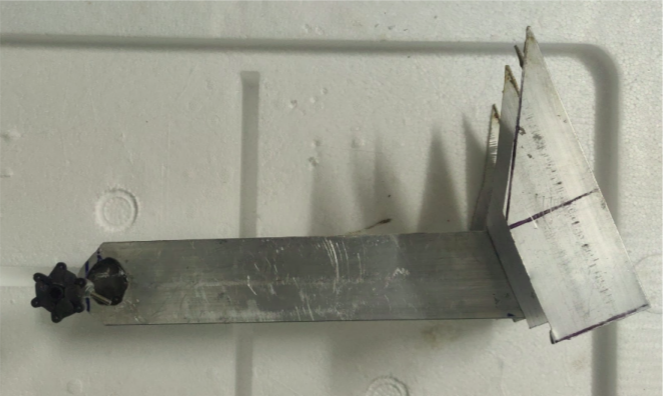

Usually, the plough tool’s angle of inclination and length of the tool are calibrated by
considering the depth required for ploughing the soil and it varies with the type of crops
and soil. The tool is operated using a dc servo motor. Instead of the conventional
method, the torque generated by the servo is used for ploughing. Moreover, the weight
of the bot is reduced by using an aluminium plough tool.

#### SEEDING : 

The next major step in the process of farming is seeding.
Seeding usually depends on the type of crops being grown
and the type of seeding varies over a variety of crops. In
case of robots, utmost care has to be taken to ensure
uniform spacing and controlled flow of the seeds from the
bot. 

To ensure this, a cell-based seeding metering mechanism
has been used in which seeds are collected and delivered by
a series of equally spaced cells on the periphery of circular
wheel. Considering the seed spacing required for different
crops, the user can adjust the speed of the motor attached to
the cell using a potentiometer to adjust the seed spacing. 

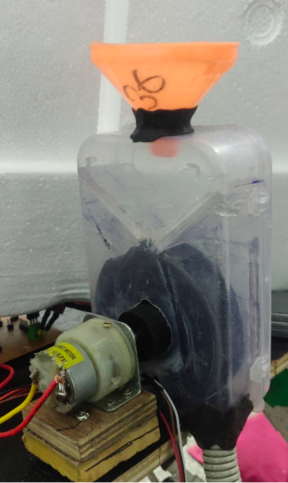

#### IRRIGATION:

Based on the amount of water required for that
particular crop suitable irrigation methods are adopted.
The bot inculcate the drip irrigation for the irrigation
process. The water required for the irrigation is stored in
a container and is connected to the bot via a pipe. The
frequency of drop of the water is controlled using water
pump. The water from the container flows to the field
through the structure provided for irrigation
uniformly.There are two knobs, one for controlling
central irrigation and another for controlling sideways
irrigation. The same irrigation tool can be used for
fertilizing by replacing the water with fertilizer. 

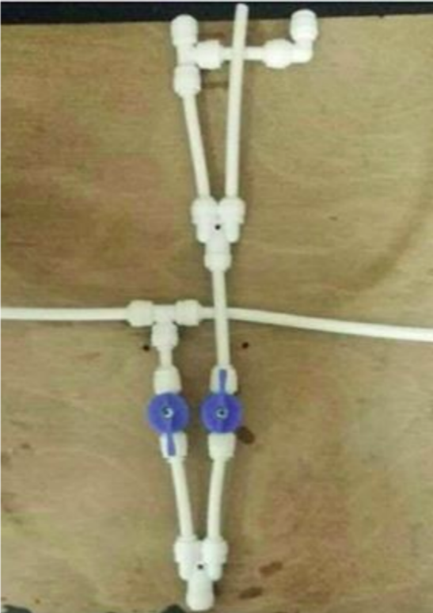

A Moisture sensor has been used to test the moisture
content in the soil. The sensor will be attached to a DC
motor which will move the sensor in the z-axis to test
the soil before irrigation. A reading of :
1) 35% indicates Dry soil
2) 55% indicates Wet soil
3) 80% indicates Extreme Wet soil. 

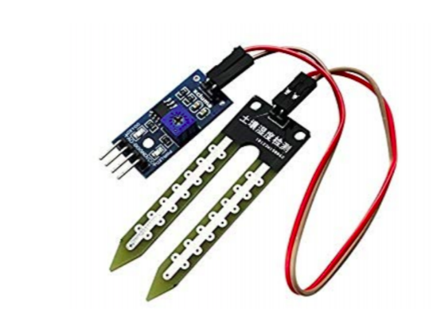

#### HARVESTING:

The final process under farming is harvesting where in
the crops are cut down or chopped using the designed
harvesting tool. The harvesting tool used in our bot is
driven by a dc motor which rotates the harvesting tool at
a sufficiently high rpm to cut down the crops. Harvesting
tool consists of blades which are attached to the
periphery of a circular wheel.
Rack and pinion mechanism has been used to move the
harvesting head in the Z-axis. The height of the head
can be varied during operation in accordance with the
type of crops. 

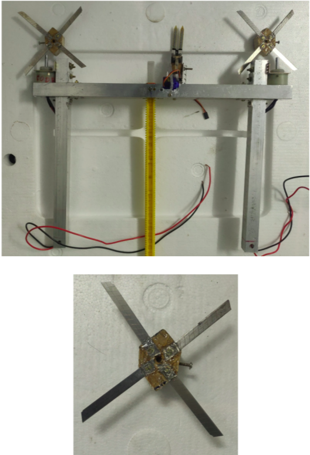

### ELECTRONICS

For the wireless communication of data, we have used
NodeMCU ESP8266. It helps us to communicate with
Arduino MEGA and Arduino MICRO using serial pins The
Node MCU is an open source firmware and development
kit that helps us to prototype our IoT product with
ArduinoIDE. It includes firmware which runs on the
ESP8266 Wi-Fi SoC. And hardware which is based on the
ESP-12 module. . Serial is used for communication
between the Arduino boards and NodeMCU. All ESP
boards have at least one serial port (also known as a
UART or USART): Serial. It communicates on RX and TX.
ELECTRONICS
Arduino MEGA takes care of the Autonomous Navigation
whereas Arduino MICRO controls Seeding and Harvesting.
NodeMCU creates a WiFi Hotspot. The user connects to
that WiFi using a device. Opening the dedicated IP
address, the user will see the shown window, where the
user can give the required commands. NodeMCU will then
give serial commands to the Arduinos.

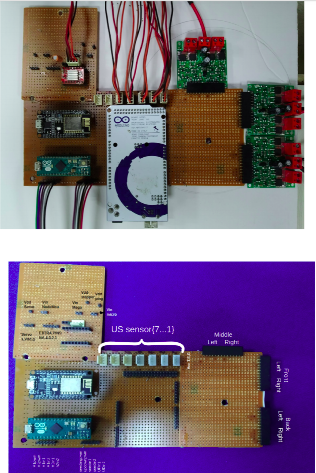

### CONTROL AND NAVIGATION

The Robot’s control architecture follows a Finite State
Machine(FSM) formulation with different behaviours as
the corresponding states. The complete structure is
explained below - 

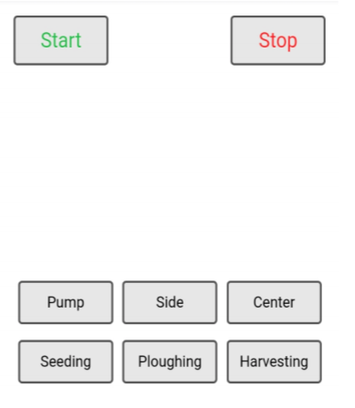

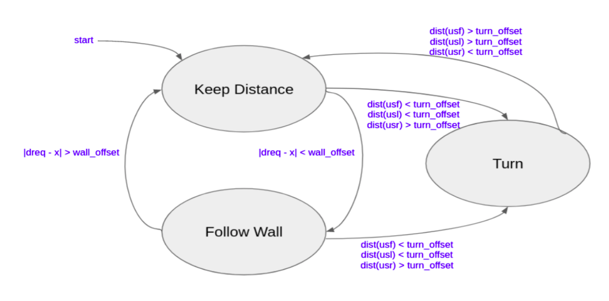

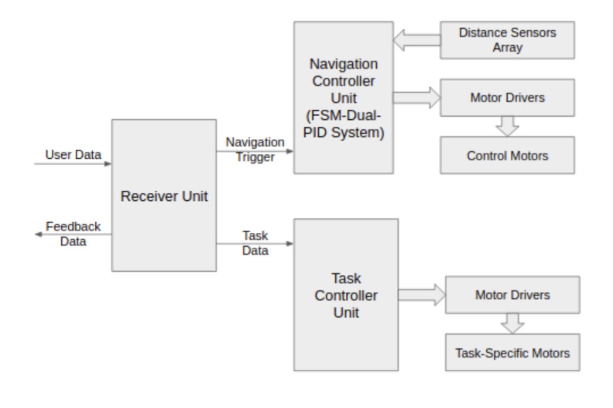

Where,

d_req → distance to be maintained from side wall

X → robot’s current distance from wall

Wall_offset → minimum error

dist(usf) → distance values from front sensor(s)

dist(usl) → distance values from left sensor(s)

dist(usr) → distance values from right sensor(s)

turn_offset → minimum distance for turning

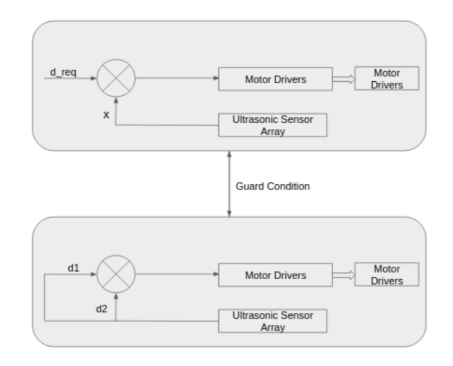

The entire autonomous navigation system starts at the “Keep Distance” node and runs until
the robot reaches the required distance. When the guard condition is turned on, “Follow Wall”
node is switched on maintaining the wall’s curve along the entire path. The two nodes switch
between themselves to maintain the required path.

When the robot reaches the end wall i.e. front sensor provides a distance less than the given
offset, the robot switches to the “Turn” node and hence performs a ~180o rotation. The
rotation is kept in check using the sensor values and offsets. At the end of the turn it switches
back to the “Keep Distance” node and the steps repeat thereafter until it reaches the red
zone.

The “Keep Distance” node uses a Proportional Gain Controller to maintain the distance while
the “Follow Wall” node uses a Proportional-Differential Gain Controller for the wall-following
behavior. This ensures a smooth trajectory for the Robot. 

### CAD Model

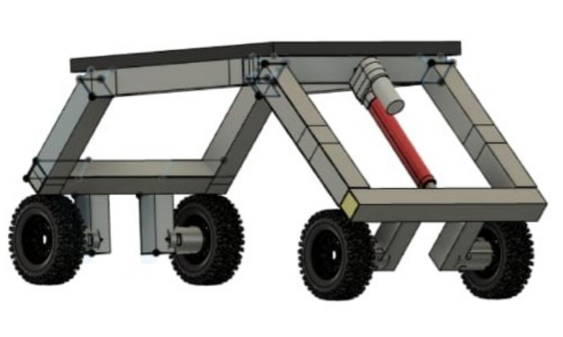
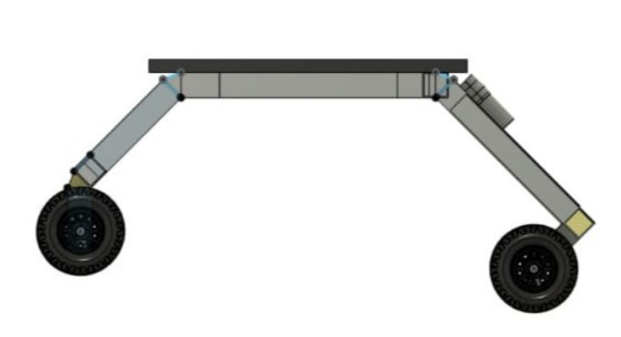

### AGRO-ECONOMIC ANALYSIS AND IMPACT

Terrace farming is carried out in the hilly areas. Usually, these are the most underdeveloped regions in a country. The challenges of terrace agriculture include lack of
quality land area for agriculture, erosion and loss of soil fertility, low yield, poor access to
agricultural inputs and services, lack of mechanization, labor shortages, and poverty.
Agronomic strategies that could help address these concerns include intensification of
terraces using agro-ecological approaches along with introduction of light-weight, low-cost,
and purchasable tools and affordable inputs that enhance productivity and reduce female
drudgery.

By providing a quite versatile, efficient and cost-effective solution, this bot tries to cater the
requirement of the farmers. The bot enhances the yield by using minimal human labour.
Considering a country like India, where agriculture employs 50% of the work force and
contribute 17-18 % of the country’s GDP, the impact created by such a bot is huge. 

### Conclusion

Thus, this bot has the potential to replace all the existing robotic systems or
those systems which still require a lot of manpower; hence change the
course of the future. Its simplicity and cost effectiveness have been its major
weapons. Limited hardware use makes it easy to handle and maintenance
free. A simple communication protocol enables the system to function
without any technical problems and also provides real time solutions. In a
broader sense, this bot can be configured and programmed to suit any
modern day system environment.

### References

http://www.tjprc.org/view_full_paper.php?id=10546&type=html

http://www.internationaljournalssrg.org/IJEEE/2018/Volume5-Issue1/IJEEE-V5I1P104.pdf

https://ieeexplore.ieee.org/document/8212756/;jsessionid=lWCrxbeAZ5z3-yqcXPLENOuAdT_u25isn8XYfKSBUTidiYejFenV!-1044746521

https://iopscience.iop.org/article/10.1088/1757-899X/325/1/012019/pdf

https://ijritcc.org/download/conferences/ICIIIME_2017/ICIIIME_2017_Track/1499063563_03-07-2017.pdfdocument/7793638

